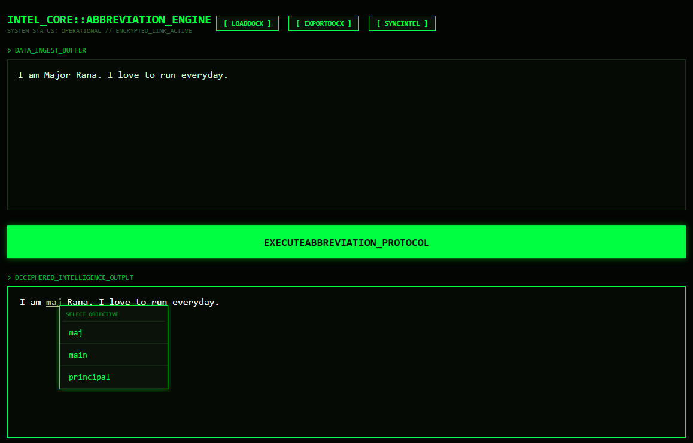

# ABBREVIATION_ENGINE (v2.0)

 
 
*Above: A tactical overview of the ABBREVIATION_ENGINE terminal interface.*

## // CLASSIFIED_PROJECT_DOSSIER //

**DESIGNATION:** Tactical Text-Optimization & Linguistic Compression System
**STATUS:** Operational | Encrypted Link Active
**RELEASE_DATE:** 2026.02.02
**AUTHOR(S):** [Your Name/Team Name]

---

### **1. PROJECT_OVERVIEW**

`ABBREVIATION_ENGINE` is a high-performance intelligence tool engineered for the rapid conversion of verbose command-level communications and raw data streams into standardized, mission-critical tactical shorthand. Designed for environments demanding absolute precision and speed, the engine facilitates the dynamic transformation of long-form documentation into high-density, actionable intelligence.

---

### **2. CORE_CAPABILITIES**

* **`[SYNC]` Live Dictionary Management:**
    * Establishes a direct, secure synchronization with external `.XLSX` datasets (e.g., `abbr.xlsx`).
    * Allows for real-time lexicon updates, ensuring the abbreviation database remains current without requiring system restarts.
    * **Operation:** Utilize the `[ SYNC_INTEL ]` button to upload and update the primary abbreviation dictionary.

* **`[PARSE]` Document Ingestion & Processing:**
    * Automates the ingestion of raw `DOCX` telemetry (Word documents).
    * The system intelligently parses incoming text, identifying full-form nomenclature eligible for "Tactical Compression."
    * **Operation:** Use the `[ LOAD_DOCX ]` button to import documents into the input buffer.

* **`[SELECT]` Intelligent Conflict Resolution:**
    * When the engine identifies multiple valid abbreviations for a single full-form term, it initiates a sub-terminal popup.
    * Operators can then interactively select the most appropriate variant, ensuring contextual accuracy in the final output.
    * **Operation:** Click on any highlighted abbreviation in the `DECIPHERED_INTELLIGENCE_OUTPUT` panel to open the selection popup.

* **`[ENFORCE]` Output Protocol & Export:**
    * Ensures 100% adherence to authorized shorthand protocols, maintaining message clarity and compliance.
    * Processed intelligence can be exported into a new `.DOCX` file, ready for dissemination.
    * **Operation:** The `EXECUTE_ABBREVIATION_PROTOCOL` button initiates the conversion, and `[ EXPORT_DOCX ]` saves the result.

---

### **3. OPERATIONAL_GUIDE**

1.  **Initialize Dictionary:** Ensure your `abbr.xlsx` file is updated. If not, use `[ SYNC_INTEL ]` to load your current abbreviation database.
2.  **Ingest Data:** Click `[ LOAD_DOCX ]` to import your target Word document into the `DATA_INGEST_BUFFER`. You can also manually type or paste text here.
3.  **Execute Protocol:** Press `EXECUTE_ABBREVIATION_PROTOCOL`. The `DECIPHERED_INTELLIGENCE_OUTPUT` will display the processed text.
4.  **Refine Intelligence:** Click on any highlighted (green) abbreviation in the output to select alternative forms via the `SELECT_OBJECTIVE` popup.
5.  **Export Briefing:** Use `[ EXPORT_DOCX ]` to save the final, optimized document.

---

### **4. SYSTEM_SPECIFICATIONS**

* **Interface:** High-Contrast OLED Terminal (Optimized for low-light environments).
* **Font-Face:** Consolas (Monospaced, for enhanced readability of technical data).
* **Core Logic:** Non-destructive parsing with advanced punctuation shielding.
* **Framework:** .NET / WPF
* **External Dependencies:** `ClosedXML`, `DocumentFormat.OpenXml`

---

### **5. AUTHORIZED_ACCESS**

This software is for authorized personnel only. Unauthorized access, modification, or distribution is strictly prohibited. All activity is logged and monitored.

---

### **6. PROJECT_LOG**

* **v2.0 (2026.02.02):**
    * Implemented "OLED High-Contrast Terminal" UI.
    * Enhanced `[SYNC]` functionality for robust `.XLSX` integration.
    * Refined `[SELECT]` conflict resolution popup with tactical pointers.
    * Improved `DOCX` parsing and export stability.
* **v1.0 (Initial Release):**
    * Basic abbreviation replacement engine.
    * Initial `.DOCX` and `.XLSX` support.

---
